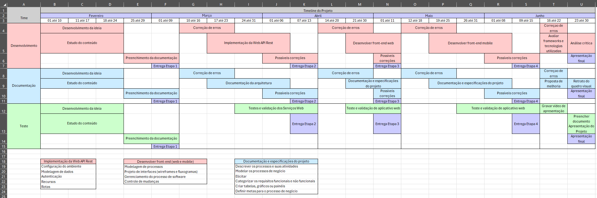

# Introdução

Atualmente, existe a discussão entre facilitar o trabalho desempenhado na sociedade por meio do uso da tecnologia, bem como os seus demais usos cotidianos. Neste sentido, Alexandre Cappellozza aponta que[1](#sdfootnote1sym):

*"As Tecnologias de Informação estão amplamente inseridas no cotidiano do ser humano, facilitando **suas atividades rotineiras**, **seja para trabalhar** ou estudar, seja para manter-se informado com relação às notícias de seu interesse, relacionar-se com outras pessoas e comunicar-se com familiares ou amigos (Bargh & Mckenna, 2004). Em 2015, a quantidade de usuários que utilizaram a Internet por meio de computadores ou dispositivos móveis foi estimada em 3,1 bilhões de pessoas em todo o mundo, o que equivale a 40% de toda a população global. No Brasil, o total de usuários atingiu 107 milhões de pessoas, o que representa 53% da população nacional e coloca o país na quinta posição na lista dos que mais acessam a rede, após China, Estados Unidos, Índia e Japão (Emarketer, 2014)"* (grifo nosso)

Embora esteja em nossa volta, ainda pode haver muita resistência em adaptar velhas rotinas a condutas mais eficazes, além disso, existe, também, um desconhecimento do que pode ser proporcionado por meio do uso correto da digitalização. De mais a mais, o ambiente de ensino é um dos locais que mais vem passando por mudanças nos últimos anos, principalmente com o período pandêmico recente, conforme pode ser observado nas palavras de Jesus Izquierdo [2](#sdfootnote1sym):

*"**A inclusão digital nos remete à participação das novas gerações na revolução tecnológica**, da qual nos falava Suzman (2021). Assim, falar da necessidade de fortalecer a relação entre a inclusão digital e o desempenho escolar nos dá a oportunidade de pensarmos na possibilidade de transformar o mundo começando pela vida das pessoas. Essa não é tarefa fácil. Nossas vivências junto ao ensino remoto nos permitiu verificar que muitos alunos careciam de condições mínimas para participar das aulas virtuais. Sem conexão à internet, sem equipamento e espaço físico adequado, para esses jovens, **o período da pandemia se tornou sinônimo de ruptura com o sistema escolar**"* (grifo nosso)

Dessa forma, instituições escolares devem sempre estar atentas nas inovações que possam trazer benefícios para todos os indivíduos que participam direta e indiretamente de suas atividades. Diversas vantagens são notadas para os alunos, responsáveis, professores e coordenadores quando a tecnologia é usada como força motor na otimização das atividiades escolares. Diante deste cenário, observando a necessidade de virtualizar a agenda de atividades diárias dos alunos do Instituto Batista Itatiaia (IBI), o presente grupo escolheu criar uma agenda digital para a entidade escolar.

[1](#sdfootnote1sym) CAPPELLOZZA, Alexandre et al. **Uso Pessoal das Tecnologias no Trabalho: Motivadores e Efeitos à Distração Profissional**. Disponível em: <https://doi.org/10.1590/1982-7849rac2017160145>.

[2](#sdfootnote1sym). IZQUIERDO, Jesus et al. **Inclusão digital e desempenho escolar no contexto da pandemia: uma análise comparativa entre Brasil e Colômbia**. Disponível em <https://doi.org/10.15448/1984-7289.2023.1.42196>. 

## Problema
O Instituto Batista Itatiaia é uma entidade ensino infantil, poussindo uma grande quantidade de alunos. Devido a isto, há uma demanda muito alta para os professores e administradores, que detém, dentre outras atividades decorrentes do ensino, a tarefa de registrar os eventos ocorridos de cada aluno durante todo o período do dia em que as crianças se encontram na instituição.

Atualmente, todo o processo desse registro de informações é feito de modo manual, com isso, o tempo para realizar esses relatórios tem se tornado muito extenso, gerando uma sobrecarga para os professores e administradores. Sendo assim, é uma necessidade fundamental a modernização do sistema que vem sendo utilizado no ambiente escolar.

Portanto, existe a dificuldade de criar um aplicativo responsivo e funcional, em um curto período de tempo, para o fácil acesso dos professores, coordenadores, pais e demais responsáveis.

## Objetivos
### Objetivo Geral
- Fazer uma agenda virtual para o Instituto Batista Itatiaia, com possibilidade de registro de atividades dos alunos pelos professores/coordenadores.

### Objetivos Específicos
- Tornar mais eficiente o registro de informações pelos professores/coordenadores.
- Facilitar o acesso dos pais/responsáveis a rotina dos seus filhos.
- Auxiliar o controle das turmas pelos professores/coordenadores.

## Justificativa

O grupo escolheu trabalhar com esse tema após identificar a necessidade de modernização no processo de comunicação entre escola e responsável da criança, conforme exposto nos objetivos supracitados. Atualmente, o processo é feito manualmente pelo Instituto Batista Itatiaia, de forma que ocupa bastante tempo do profissional e não permite uma ciência imediata por parte do responsável.

Com a migração desse processo para uma aplicação, ocorreria uma melhora na alocação de recursos e gestão de tempo da escola, além de aproximar os pais/responsáveis das rotinas das crianças, facilitando assim a interação entre professor, família e aluno.

## Público-Alvo

A agenda para o IBI tem como público-alvo todos os que estão envolvidos no dia a dia da instituição. Logo, são os coordenadores que vão participar da gestão das turmas; os professores que vão ser responsáveis pelas atualizações diárias da agenda e no relacionamento direto com os pais por via do aplicativo; e os pais que são o público-alvo principal dos aplicativos, pois vão utilizar o aplicativo para acompanhar a rotina do filho e fazer eventuais comentários aos professores.

# Especificações do Projeto

## Personas

**Márcia Moreira** é a *coordenadora* do Instituto há 15 anos, sempre enfrentou muitas dificuldades como coordenadora, sempre lidando com reclamações diariamente de pais é alunos. Com toda essa dificuldade Márcia decide aderir a um projeto de modernização, onde o Instituto passaria todas suas anotações sobre os alunos para uma forma virtual, assim facilitando a interação entre pais e a coordenação do Instituto. Com a modernização já implantada, os pais terão acesso ao rendimento do filho. Com isso, Márcia irá enfrentar menos problemas diários.

**Daniele Ferreira** de 32 anos é *professora* de uma turma de 37 alunos, sua turma permanece em tempo integral na instituição, tendo alguns alunos com muitas intercorrências a serem registradas. Muito do seu tempo tomado decorre de relatórios manuais, já que esse processo é feito de modo individual. A modernização desse sistema daria a ela mais tempo para pensar em outras atividades recreativas para sua turma.

**Ana Barros Ferreira**, 46 anos, é *professora* por mais de 20 anos e está no instituto há 8 anos. Ana não é particularmente muito favorável na modernização que está ocorrendo atualmente. Usa seu celular, por exemplo, apenas para troca de mensagens e acompanhar alguns vídeos sobre notícias diárias. Quando necessita acessar um aplicativo, pede auxílio a terceiros. Já no computador, Ana possui um conhecimento básico, pois foi necessitado utilizar para preenchimento de diário em trabalhos anteriores. Entretanto, se limitou a fazer apenas isso, sem possuir muito conhecimento em outras utilidades do computador.

**Jose da Silva** é um pedreiro de 45 anos, bem como também é *pai* de um estudante do IBI. Por ser um profissional muito atarefado, dedica a maior parte do seu dia ao trabalho.  Devido as longas jornadas de serviço, Jose tem pouco tempo para acompanhar o dia a dia do seu filho, que é aluno do IBI. Sendo assim Jose gostaria de alguma forma presenciar a rotina do seu filho.

**Clara Gomes** de 29 anos é *mãe* solteira e trabalha como gerente de marketing de uma grande empresa. Em meio às responsabilidades do trabalho, Clara dá o seu melhor para ser uma mãe carinhosa e presente. Dessa forma, gostaria muito de acompanhar mais ativamente o progresso de sua filha Ana Beatriz na escola, mas devido a sua rotina exaustiva isso se torna muito mais complicado. Um aplicativo, que viabilizasse o acompanhamento do desempenho de Ana pelo celular, iria permitir que Clara pudesse se manter atualizada em qualquer hora ou lugar.

## Histórias de Usuários

Com base na análise das personas forma identificadas as seguintes histórias de usuários:

|EU COMO... `PERSONA`| QUERO/PRECISO ... `FUNCIONALIDADE`       |PARA ... `MOTIVO/VALOR`                                         |
|--------------------|------------------------------------------|----------------------------------------------------------------|
|Pais/Responsáveis   | Acessar a rotina dos meu filho           | Saber como foi o dia dia dele                                  |
|Pais/Responsáveis   | Registrar comentário na rotina diária    | Manter comunicação com a escola                                |
|Professor           | Registrar a rotina de cada aluno         | Comunicar aos pais da rotina dos filhos                        |
|Professor           | Ler os comentários registrados pelos pais| Verificar se há necessidades específicas de cada aluno         |
|Coordenador         | Cadastrar usuários                       | Possibilitar o registro e acesso de informações                |
|Coordenador         | Deletar usuários                         | Possibilitar a retirada de perfis não mais vinculados a escola |

## Requisitos

As tabelas que se seguem apresentam os requisitos funcionais e não funcionais que detalham o escopo do projeto. Para determinar a prioridade de requisitos, aplicar uma técnica de priorização de requisitos e detalhar como a técnica foi aplicada.

### Requisitos Funcionais

|ID    | Descrição do Requisito  | Prioridade |
|------|-----------------------------------------|----|
|RF-001| Permitir que o administrador crie, edite e exclua usuários****   | ALTA |
|RF-002| Permitir que os professores publiquem e edite a rotina dos alunos no sistema   | ALTA |  
|RF-003| Permitir que os responsáveis dos alunos tenham acesso aos relatórios dos professores pelo calendário   | ALTA | 
|RF-004| Acessar o sistema via login   | ALTA | 
|RF-005| Permitir que os responsáveis possam fazer observações nos relatórios dos professores   | MÉDIA |
|RF-006| Permitir que os usuários alterem a senha   | MÉDIA |
|RF-007| Permitir que os responsáveis tenham acesso a mais de uma matrícula com o mesmo login****   | MÉDIA |
|RF-008| Emitir credências de usuário de forma automática ****   | MÉDIA |
|RF-009| Emitir credências de usuário de forma automática ****   | MÉDIA |
|RF-010| Permitir que os responsáveis façam observações aos professores por via de áudio****   | BAIXA |
|RF-011| Permitir que os relatórios possam ser baixados****   | BAIXA |

### Requisitos não Funcionais

|ID     | Descrição do Requisito  |Prioridade |
|-------|-------------------------|----|
|RNF-001| O sistema deve ser responsivo para rodar em um dispositivos móvel | ALTA | 
|RNF-002| O sistema deve possuir uma interface de baixa complexidade para uso | ALTA | 
|RNF-003| O sistema será acessado apenas online | MÉDIA | 
|RNF-004| Deve processar requisições do usuário em no máximo 3s | BAIXA | 
|RNF-005| O sistema será hospedado na nuvem | BAIXA |

## Restrições

O projeto está restrito pelos itens apresentados na tabela a seguir.

|ID| Restrição                                             |
|--|-------------------------------------------------------|
|01| O projeto deverá ser entregue até o final do semestre |
|02| Estar em conformidade com as leis brasileiras de proteção de dados |
|03| Cada etapa do projeto deve ser entregue nos prazos pré-definidos |
|04| O projeto não poderá depender de qualquer tipo de orçamento |
|05| O projeto deverá ser desenvolvido apenas pela equipe pré definida |

# Catálogo de Serviços

O projeto vai oferecer, como principal serviço ao IBI, uma agenda para os pais acessarem a rotina dos filhos de forma prática no celular. De mais a mais, também irá auxiliar o Instituto a otimizar a forma que a rotina do estudante é entregue aos responsáveis, já que, atualmente, é feita de forma manual, preenchendo formulário de cada aluno. Junto com a agenda, o projeto também vai auxiliar o Instituto a modernizar a forma como eles acessam dados, pois, para o uso da agenda, será necessário criar um banco de dados, o qual será muito útil para consultas futuras.

# Gerenciamento de Projeto

## Gerenciamento de Tempo

O gráfico de Gantt ou diagrama de Gantt também é uma ferramenta visual utilizada para controlar e gerenciar o cronograma de atividades de um projeto. Com ele, é possível listar tudo que precisa ser feito para colocar o projeto em prática, dividir em atividades e estimar o tempo necessário para executá-las.

## Gerenciamento de Equipe

O gerenciamento adequado de tarefas contribuirá para que o projeto alcance altos níveis de produtividade. Por isso, é fundamental que ocorra a gestão de tarefas e de pessoas, de modo que os times envolvidos no projeto possam ser facilmente gerenciados. 

# Arquitetura da Solução

## Tecnologias Utilizadas

No presente projeto, serão utilizadas as seguintes tecnologias:

**Visual Studio** - É a IDE que será utilizada para o desenvolvimento do projeto 

**Git** - É a ferramenta para controle de versões de software que será utilizada durante o projeto 

**C#/ASP .NET Core** – Para o desenvolvimento back-end da agenda será utilizado o Framework ASP .NET Core, um framework que utiliza a linguagem C#, para a criação da API que irá acessar e controlar o back-end a partir de requisições do front-end. 

**React JS** – Para o desenvolvimento front-end web da aplicação, será utilizado React JS, um framework que utiliza a linguagem Javascript, o qual auxiliará a criar uma interface web responsiva tanto no computador, quanto no mobile da aplicação, 

**React Native** – Para o desenvolvimento front-end da aplicação, será utilizado o React Native, um framework que utiliza do Javascript, o qual auxiliará a criar uma interface mobile utilizando os recursos nativos de celulares e tablets, por exemplo. 

**MySQL** – Para o desenvolvimento do back-end, será utilizado o MySQL, um banco de dados relacional, o qual auxiliará na criação e gerenciamento do banco de dados que será utilizado na aplicação 

## Hospedagem

A aplicação estará pronta para ser utilizada no *Repl.it* de forma inicial, porém é uma solução a curto prazo para o desenvolvimento e teste da aplicação. Caso o cliente decida dar continuidade a aplicação, é recomendado fazer a hospedagem na nuvem ou investir em um servidor próprio.

